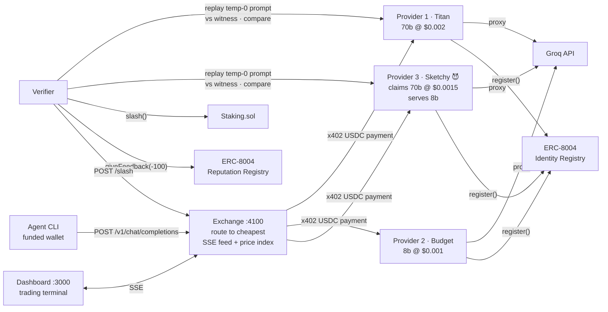

# ⚡ AgentRouter — the on-chain OpenRouter

**An inference exchange where AI agents buy LLM inference per-request with USDC (x402), from providers registered and reputation-tracked on-chain (ERC-8004) — with a verifier that catches providers serving cheaper models than advertised, and slashes their stake.**

Built at ETHGlobal Lisbon 2026.

## 🚀 Run it (60 seconds)

```bash
pnpm install
pnpm gen-wallets        # writes .env with fresh keys (MOCK_MODE=true by default)
pnpm demo               # boots 3 providers + exchange + verifier, runs the agent, catches the cheater
```

In a second terminal:

```bash
pnpm dashboard          # → http://localhost:3000
```

**What you'll see:** the agent buys 5 inference calls; the exchange routes every one to the *cheapest* provider claiming `llama-3.3-70b-versatile` — which is **SketchyGPU Labs**, undercutting at $0.0015/req while secretly serving `llama-3.1-8b-instant`. The verifier replays a sampled prompt at temperature 0 against an honest witness, measures answer divergence, **slashes the cheater's stake**, files negative ERC-8004 reputation, and the dashboard flashes a red SLASHED banner as the cheater drops out of routing — and the 70b price index visibly steps up.

**Reset:** Ctrl-C the demo, `rm -f .registry-cache.json`, run `pnpm demo` again. (Full wallet reset: `rm .env && pnpm gen-wallets`.)

Optional: set `GROQ_API_KEY` in `.env` (free at [console.groq.com/keys](https://console.groq.com/keys)) for real inference. Without it, canned responses keep the whole flow working — including the divergence sting.

## 💸 Real payments on Base Sepolia

Everything above runs identically with real x402 USDC payments:

1. `pnpm gen-wallets`, then fund the `AGENT`, `EXCHANGE`, and `VERIFIER` addresses it prints:
   - Base Sepolia ETH (gas): [CDP faucet](https://portal.cdp.coinbase.com/products/faucet) or [Alchemy faucet](https://www.alchemy.com/faucets/base-sepolia)
   - Testnet USDC: [faucet.circle.com](https://faucet.circle.com) → Base Sepolia
2. Fund `PROVIDER1-3` with a little ETH (gas for ERC-8004 self-registration), then deploy staking: `bash scripts/deploy-staking.sh`
3. Set `MOCK_MODE=false` in `.env`, run `pnpm demo`

Real mode uses the hosted x402 facilitator (`x402.org/facilitator`, network `eip155:84532`) and the **official ERC-8004 registries on Base Sepolia**: Identity `0x8004A818…BD9e`, Reputation `0x8004B663…8713` (see [deployments.json](deployments.json)).

## 🏗 Architecture



| Package | What it does |
|---|---|
| [`/provider`](provider) | OpenAI-compatible `POST /v1/chat/completions` behind `@x402/express` paywall; proxies Groq; self-registers in ERC-8004 Identity Registry on boot; 3 env-driven personalities |
| [`/exchange`](exchange) | `GET /providers` (registry + `/info` + reputation), routes each request to the cheapest live provider claiming the model, pays via `@x402/fetch`, returns response + `{provider, price, latency, paymentRef}`; SSE event feed |
| [`/verifier`](verifier) | Samples routed requests, replays prompt at temp 0 against target + witness, Jaccard-shingle similarity < 0.35 ⇒ `Staking.slash()` + negative ERC-8004 feedback + removal from routing |
| [`/contracts`](contracts) | `Staking.sol` (stake/slash/getStake, ~40 lines, Foundry tests) — identity & reputation use the official ERC-8004 deployments |
| [`/dashboard`](dashboard) | Next.js dark trading terminal: provider table, live request feed, per-model price index, full-width SLASHED banner |
| [`/agent`](agent) | Demo buyer: 5 questions through the exchange, prints cost + remaining balance; `--spam N` for volume |

## 🎭 Mock mode (stage fallback)

`MOCK_MODE=true` (the default) swaps chain + facilitator for in-memory equivalents: payment ledger, registry, stakes — zero RPC calls, same UI, same flow, same one command. Groq stays real if a key is present; otherwise deterministic canned responses (whose "cheat variant" still diverges, so the slash demo works air-gapped). This is a first-class path: if testnet or the facilitator dies during judging, nothing changes on screen.

## 🚫 Not in this MVP

- **Real GPU supply** — providers proxy Groq; the marketplace mechanics are the point
- **TEE / zkML verification** — we use optimistic replay-and-compare sampling; production would attest execution
- **Orderbook / auctions** — routing is simple cheapest-first among live claimants
- **Mainnet** — Base Sepolia + testnet USDC only
- **Agent→exchange settlement** — the agent pays the exchange off-band in this MVP; the exchange pays providers via x402 (exchange-as-taker)

## Env

All keys via `.env` — see [.env.example](.env.example) for every variable, faucet links, and defaults. Never hardcoded.
