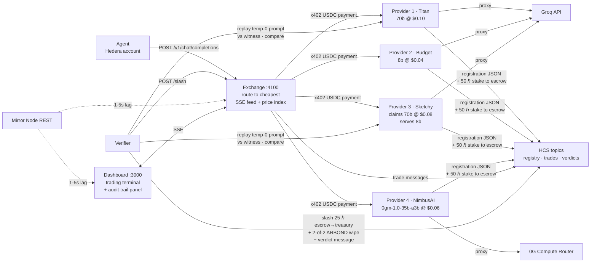

# AgentRouter — the on-chain OpenRouter

AgentRouter is an on-chain OpenRouter for **agentic payments**: autonomous AI agents buy LLM
inference per request with **USDC over x402**, settled with Hedera's **sub-second finality and
low, predictable fees**. Providers carry an **HCS-14-style** on-chain identity registered
through the **Hedera Agent Kit**, stake HBAR collateral, and hold an **HTS ReputationBond** —
and a verifier that catches providers serving cheaper models than advertised **destroys their
bond with a 2-of-2 multi-sig wipe** on top of slashing their staked HBAR.

Built at ETHGlobal Lisbon 2026 — **no Solidity anywhere**. Everything on-chain runs on Hedera
Testnet through the Hedera SDKs: agentic x402 payments, Agent-Kit identity, an HCS audit trail,
and HTS reputation with **custom fee schedules + freeze/pause/wipe compliance controls** enforced
by a **2-of-2 multi-sig wipe**. See [docs/HEDERA_BOUNTIES.md](docs/HEDERA_BOUNTIES.md) for how
this maps to each Hedera prize track.

## Quickstart

Prerequisites: Node 22+ and pnpm (`corepack enable`).

```bash
pnpm install
pnpm demo            # boots the fleet, runs the agent, catches the cheater — no chain needed
pnpm dashboard       # second terminal, then open http://localhost:3000
```

`pnpm demo` runs in mock mode by default (in-memory payments, registry, and stakes — zero RPC
calls). The agent buys five inference calls; the exchange routes each to the cheapest provider
claiming `llama-3.3-70b-versatile` — which is SketchyGPU Labs, undercutting on price while
secretly serving a smaller model. The verifier replays a sampled prompt against an honest
witness, measures the divergence, slashes the cheater's stake, publishes the verdict to HCS,
and the dashboard flags the slash as the cheater drops out of routing. As a final beat, the demo
buys one completion sourced from **0G Compute** (NimbusAI's `0gm-1.0-35b-a3b`) — a second,
decentralized-GPU supply network settling on the same rails.

Reset: Ctrl-C the demo, `rm -f .registry-cache.json`, then run `pnpm demo` again. Set
`GROQ_API_KEY` in `.env` for real inference; without it, deterministic canned responses keep
the whole flow (including the fraud divergence) working offline.

## Architecture

Three autonomous actors — a buyer agent, provider agents, and a verifier — trade around a
routing exchange, settling in USDC over x402 and recording identity, trades, and verdicts on
Hedera Consensus Service.



Full architecture, the end-to-end flow, and the Hedera SDK/tooling stack:
[docs/ARCHITECTURE.md](docs/ARCHITECTURE.md).

| Package | What it does | Docs |
|---|---|---|
| [`packages/agent`](packages/agent) | Autonomous buyer making agentic x402 payments: routes each goal to a model tier from the live market, buys the answer through the exchange (one goal = one purchase; decomposition opt-in), budget-capped; registers its HCS-14-style identity via the **Hedera Agent Kit** | [agent.md](docs/agent.md) |
| [`packages/provider`](packages/provider) | OpenAI-compatible inference behind an x402 USDC paywall (native HBAR via `SETTLEMENT_ASSET=hbar`); on boot stakes HBAR to escrow and holds an **HTS ReputationBond** (Hiero SDK). Default supply backend: **0G Compute** (decentralized GPU network); groq/canned selectable per instance | [provider.md](docs/provider.md) |
| [`packages/exchange`](packages/exchange) | Discovers supply from HCS, routes each request to the cheapest live provider claiming the model, pays via x402, publishes trades | [exchange.md](docs/exchange.md) |
| [`packages/verifier`](packages/verifier) | Samples routed traffic, replays against an honest witness; on divergence slashes staked HBAR and **destroys the HTS bond with a 2-of-2 multi-sig wipe** (verifier + auditor) | [verifier.md](docs/verifier.md) |
| [`packages/dashboard`](packages/dashboard) | Next.js trading terminal: provider table, live feed, price index, slash banner, HCS audit panel | [ARCHITECTURE.md](docs/ARCHITECTURE.md) |
| [`packages/shared`](packages/shared) | Shared Hedera plumbing, HCS helpers, chat types, and constants used by every service | — |
| [`packages/provider-mcp`](packages/provider-mcp) | MCP server: exposes provider onboarding (account, stake, HCS-14 registration, liveness check) as agent-callable tools | [README](packages/provider-mcp/README.md) |

## Real payments on Hedera Testnet

Put operator credentials in `.env`, run `pnpm setup-hedera` (create + fund the role accounts
and associate each with USDC), `pnpm setup-hcs` (audit topics), and `pnpm setup-hts` (create the
**HTS ReputationBond** token + grant each provider its bond), set `MOCK_MODE=false`, then run
`pnpm demo`.

Payments settle in **HTS USDC** (`0.0.429274`, 6 dp) via x402 v2 `exact` on `hedera:testnet`,
through a fee-sponsored facilitator (payers need no gas). USDC needs one manual step — testnet
USDC comes from [Circle's faucet](https://faucet.circle.com), not the operator — so set
`SETTLEMENT_ASSET=hbar` for a fully scriptable, faucet-free run. Staking, slashing and the
ReputationBond are unaffected either way: collateral is always native HBAR, reputation is always
the ARBOND token.

On fraud, the verifier destroys the cheater's ARBOND bond with a **2-of-2 multi-sig `TokenWipe`**
(verifier + auditor) — all SDK-native, no Solidity.

Live settlement + token/freeze/wipe/slash transactions and account links:
[docs/PROOF.md](docs/PROOF.md). Funding decisions: [docs/FUNDING.md](docs/FUNDING.md).
Moving an existing deployment to USDC: [docs/MIGRATION-USDC.md](docs/MIGRATION-USDC.md).

## Bounties & outcomes

Everything on-chain is SDK-native across three Hedera services — **HCS, HTS, Mirror Node** — with
**zero Solidity**, plus a **0G Compute** decentralized-GPU supply integration. Full per-bounty
mapping (with `file:line` + Hashscan proof): [docs/HEDERA_BOUNTIES.md](docs/HEDERA_BOUNTIES.md).

### Hedera prize tracks

| Hedera prize track | Fit | What AgentRouter uses |
|---|---|---|
| **AI & Agentic Payments** | **Implemented** | Autonomous AI agent making per-request **x402** payments in **HTS USDC** (native HBAR behind one flag); **Hedera Agent Kit** identity; HCS-14-style UAIDs; HCS audit trails |
| **"No Solidity Allowed"** | **Implemented** | Whole economic loop — identity, stake, slash, HTS bond, multi-sig wipe — via **Hedera SDKs** across HCS + HTS + Mirror Node, no contracts |
| **Tokenization (HTS)** | **Implemented** | **HTS ReputationBond** with a **custom fractional fee** + **freeze/pause/wipe compliance controls** + a **2-of-2 multi-sig `TokenWipe`** on fraud; settlement itself rides a second HTS token (USDC) |

### 0G Compute — decentralized GPU supply

Provider 4 (**NimbusAI**) resells inference from the **0G Compute Router** — one OpenAI-compatible
endpoint over 0G's decentralized GPU marketplace (`0gm-1.0-35b-a3b`, TEE-signed results) — and it's
the **default bring-your-own backend** for anyone onboarding new supply (`groq`/`canned` selectable
per instance). It joins the marketplace **permissionlessly**: boots, stakes, registers on HCS, and
is discovered within seconds. Its full on-chain legs — stake, HCS registration carrying the 0G model
id, and a settled USDC trade — ran on Testnet **2026-07-26** ([docs/PROOF.md](docs/PROOF.md)).

### What's live on-chain

- **Real USDC settlement** — two HTS transfers per request (agent → exchange `price + fee`,
  exchange → provider `price`), in **HTS USDC** (`0.0.429274`), fee-sponsored so payers need no gas.
- **HTS ReputationBond** (`ARBOND`, `0.0.9758338`) — a **2% custom fractional fee** +
  **freeze/pause/wipe** keys; a **2-of-2 multi-sig `TokenWipe`** destroyed a caught cheater's bond
  on Testnet **2026-07-26**.
- **Native-HBAR staking + slashing** — 50 ℏ stake to a plain escrow *account*, 25 ℏ escrow → treasury
  slash on fraud, no contract deployed.
- **HCS audit trail** — registry · trades · verdicts topics, every registration/trade/verdict
  replayable from the public Mirror Node.
- **Live hosted** — dashboard on Vercel + exchange API on Railway; buy an inference call yourself in
  [docs/TESTING.md](docs/TESTING.md).

Full receipts + Hashscan links: [docs/PROOF.md](docs/PROOF.md) ·
[docs/TRANSACTIONS.md](docs/TRANSACTIONS.md).

## Network impact

Every unit of marketplace activity is an on-chain Hedera transaction — usage growth *is*
network growth, with no off-chain batching in between.

| Event | Hedera transactions produced |
|---|---|
| An agent or provider onboards | 1 account created + 1 HCS registry message (HCS-14 identity) |
| A provider lists | 1 HBAR transfer (50 ℏ stake → escrow) + 1 HTS transfer (ARBOND bond) |
| **One inference request** | **2 settlement transfers (x402, both legs) + 1 HCS trade message** |
| One audit | up to 2 x402 replay payments + 1 HCS verdict message |
| One fraud caught | 1 HBAR transfer (escrow → treasury) + HTS freeze + multi-sig wipe + 1 HCS verdict message |

The steady-state load is dominated by the per-request path, so impact scales linearly:
**3 on-chain transactions per inference call.** A single agent doing 1,000 calls/day generates
3,000 Hedera transactions/day; 1M routed requests is 3M transactions — 2M settlement transfers
and 1M HCS messages.

Every participant is a distinct Hedera account with an HCS-14 identity, so the marketplace
grows accounts as it grows supply and demand. And because the audience is AI-agent and x402
developers rather than existing crypto users, that growth comes from outside the current
ecosystem. Business framing: [docs/BUSINESS.md](docs/BUSINESS.md).

## Documentation

Everything lives in [docs/](docs/README.md). Start there, or jump to:

- [ARCHITECTURE.md](docs/ARCHITECTURE.md) — actors, flow, and the Hedera stack
- [GUIDE.md](docs/GUIDE.md) — env vars, demo script, components, troubleshooting
- Services: [agent.md](docs/agent.md) · [provider.md](docs/provider.md) · [exchange.md](docs/exchange.md) · [verifier.md](docs/verifier.md) · [FRONTEND.md](docs/FRONTEND.md)
- [HEDERA_BOUNTIES.md](docs/HEDERA_BOUNTIES.md) — per-bounty mapping to the Hedera prize tracks
- [DEPLOY.md](docs/DEPLOY.md) — production URLs, per-service config, runbook · [TESTING.md](docs/TESTING.md) — live URLs, buy an inference call
- [PROOF.md](docs/PROOF.md) · [TRANSACTIONS.md](docs/TRANSACTIONS.md) — on-chain evidence and how native staking/slashing works
- [FUNDING.md](docs/FUNDING.md) · [MIGRATION-USDC.md](docs/MIGRATION-USDC.md) — settlement funding + the HBAR→USDC migration
- [RESEARCH.md](docs/RESEARCH.md) · [DEVREL_BRIEF.md](docs/DEVREL_BRIEF.md) · [HEDERAFEEDBACK.md](docs/HEDERAFEEDBACK.md)

## Repository layout

```
packages/
  agent/       buyer agent
  provider/    inference supply (four personalities; 0G Compute default backend)
  exchange/    routing + settlement core
  verifier/    fraud auditor
  dashboard/   Next.js trading terminal
  shared/      Hedera + HCS + x402 plumbing
  provider-mcp/ MCP server for agent-driven provider onboarding
scripts/       demo, smoke, and Hedera/HCS setup
docs/          all documentation
.claude/skills/ onboarding-a-provider — the guided setup walkthrough
```

## Roadmap

Planned work is tracked in the repo's [open issues](https://github.com/GigaHierz/ETH-global-lisbon-2026/issues).

## Environment

All configuration is via `.env` — see [.env.example](.env.example). Nothing is hardcoded or
committed (`.env` is gitignored). Full variable reference in [docs/GUIDE.md](docs/GUIDE.md).
