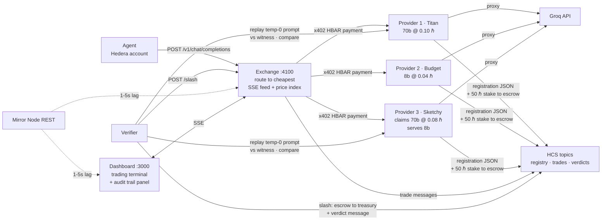

# AgentRouter — the on-chain OpenRouter

AgentRouter is an on-chain OpenRouter for **agentic payments**: autonomous AI agents buy LLM
inference per request with **native HBAR over x402**, settled with Hedera's **sub-second
finality and low, predictable fees**. Providers carry an **HCS-14-style** on-chain identity
registered through the **Hedera Agent Kit**, stake HBAR collateral, and hold an **HTS
ReputationBond** — and a verifier that catches providers serving cheaper models than advertised
**freezes their bond and executes a multi-sig scheduled wipe** (Hedera Schedule Service) on top
of slashing their staked HBAR.

Built at ETHGlobal Lisbon 2026 — **no Solidity anywhere**. Everything on-chain runs on Hedera
Testnet through the Hedera SDKs: agentic x402 payments, Agent-Kit identity, an HCS audit trail,
HTS reputation with **custom fee schedules + freeze/pause/wipe compliance controls**, and
Schedule-Service enforcement. See [docs/HEDERA_BOUNTIES.md](docs/HEDERA_BOUNTIES.md) for how
this maps to each Hedera prize track.

## Quickstart

Prerequisites: Node 22+ and pnpm (`corepack enable`).

```bash
pnpm install
pnpm demo            # boots the fleet, runs the agent, catches the cheater — no chain needed
pnpm dashboard       # second terminal, then open http://localhost:3000
```

`pnpm demo` runs in mock mode by default (in-memory payments, registry, and stakes — zero RPC
calls). The agent buys five inference calls; the exchange routes each to the cheapest provider
claiming `llama-3.3-70b-versatile` — which is SketchyGPU Labs, undercutting on price while
secretly serving a smaller model. The verifier replays a sampled prompt against an honest
witness, measures the divergence, slashes the cheater's stake, publishes the verdict to HCS,
and the dashboard flags the slash as the cheater drops out of routing.

Reset: Ctrl-C the demo, `rm -f .registry-cache.json`, then run `pnpm demo` again. Set
`GROQ_API_KEY` in `.env` for real inference; without it, deterministic canned responses keep
the whole flow (including the fraud divergence) working offline.

## Architecture

Three autonomous actors — a buyer agent, provider agents, and a verifier — trade around a
routing exchange, settling in HBAR over x402 and recording identity, trades, and verdicts on
Hedera Consensus Service.



Full architecture, the end-to-end flow, and the Hedera SDK/tooling stack:
[docs/ARCHITECTURE.md](docs/ARCHITECTURE.md).

| Package | What it does | Docs |
|---|---|---|
| [`packages/agent`](packages/agent) | Autonomous buyer making agentic x402 payments: plans a goal into questions, buys each answer through the exchange, budget-capped; registers its HCS-14-style identity via the **Hedera Agent Kit** | [agent.md](docs/agent.md) |
| [`packages/provider`](packages/provider) | OpenAI-compatible inference behind an x402 HBAR paywall; on boot stakes HBAR to escrow and holds an **HTS ReputationBond** (Hiero SDK); four env-driven personalities | [provider.md](docs/provider.md) |
| [`packages/exchange`](packages/exchange) | Discovers supply from HCS, routes each request to the cheapest live provider claiming the model, pays via x402, publishes trades | [exchange.md](docs/exchange.md) |
| [`packages/verifier`](packages/verifier) | Samples routed traffic, replays against an honest witness; on divergence slashes staked HBAR, **freezes the HTS bond, and multi-sig scheduled-wipes it** (Schedule Service) | [verifier.md](docs/verifier.md) |
| [`packages/dashboard`](packages/dashboard) | Next.js trading terminal: provider table, live feed, price index, slash banner, HCS audit panel | [ARCHITECTURE.md](docs/ARCHITECTURE.md) |
| [`packages/shared`](packages/shared) | Shared Hedera plumbing, HCS helpers, chat types, and constants used by every service | — |

## Real payments on Hedera Testnet

Put operator credentials in `.env`, run `pnpm setup-hedera` (create + fund the role accounts),
`pnpm setup-hcs` (audit topics), and `pnpm setup-hts` (create the **HTS ReputationBond** token
+ grant each provider its bond), set `MOCK_MODE=false`, then run `pnpm demo`. Payments are
native HBAR via x402 v2 `exact` on `hedera:testnet`, settled through a fee-sponsored facilitator
(payers need no gas). On fraud, the verifier freezes the cheater's ARBOND bond and executes a
**2-of-2 multi-sig scheduled wipe** via the Hedera Schedule Service — all SDK-native, no
Solidity. Live settlement + token/freeze/schedule/wipe transactions and account links:
[docs/PROOF.md](docs/PROOF.md). Funding decisions: [docs/FUNDING.md](docs/FUNDING.md).

## Hedera track alignment

Everything on-chain is SDK-native across four Hedera services — **HCS, HTS, Schedule Service,
Mirror Node** — with **zero Solidity**. Full per-bounty mapping (with `file:line` + Hashscan
proof): [docs/HEDERA_BOUNTIES.md](docs/HEDERA_BOUNTIES.md).

| Hedera prize track | Fit | What AgentRouter uses |
|---|---|---|
| **AI & Agentic Payments** | **Implemented** | Autonomous AI agent making per-request **x402** payments in **native HBAR**; **Hedera Agent Kit** identity; HCS-14-style UAIDs; HCS audit trails |
| **"No Solidity Allowed"** | **Implemented** | Whole economic loop — identity, stake, slash, HTS bond, scheduled wipe — via **Hedera SDKs** across HCS + HTS + Schedule + Mirror Node, no contracts |
| **Tokenization (HTS)** | **Implemented** | **HTS ReputationBond** with a **custom fractional fee** + **freeze/pause/wipe compliance controls** |
| **Cross-Chain Automation (Schedule Service)** | Implemented core + roadmap | **Schedule Service** multi-sig wipe live today; Axelar GMP cross-chain dispatch is the natural extension |
| **Autonomous On-Chain Automation** | Implemented core | Multi-sig **scheduled transactions** with no keepers/bots (verifier + auditor co-sign) |

## Documentation

Everything lives in [docs/](docs/README.md). Start there, or jump to:

- [ARCHITECTURE.md](docs/ARCHITECTURE.md) — actors, flow, and the Hedera stack
- [GUIDE.md](docs/GUIDE.md) — env vars, demo script, components, troubleshooting
- Services: [agent.md](docs/agent.md) · [provider.md](docs/provider.md) · [exchange.md](docs/exchange.md) · [verifier.md](docs/verifier.md) · [FRONTEND.md](docs/FRONTEND.md)
- [DEPLOY.md](docs/DEPLOY.md) — production URLs, per-service config, runbook
- [PROOF.md](docs/PROOF.md) · [TRANSACTIONS.md](docs/TRANSACTIONS.md) — on-chain evidence and how native staking/slashing works
- [RESEARCH.md](docs/RESEARCH.md) · [DEVREL_BRIEF.md](docs/DEVREL_BRIEF.md) · [HEDERAFEEDBACK.md](docs/HEDERAFEEDBACK.md)

## Repository layout

```
packages/
  agent/       buyer agent
  provider/    inference supply (four personalities)
  exchange/    routing + settlement core
  verifier/    fraud auditor
  dashboard/   Next.js trading terminal
  shared/      Hedera + HCS + x402 plumbing
scripts/       demo, smoke, and Hedera/HCS setup
docs/          all documentation
```

## Roadmap

Planned work is tracked in the repo's [open issues](https://github.com/GigaHierz/ETH-global-lisbon-2026/issues).

## Environment

All configuration is via `.env` — see [.env.example](.env.example). Nothing is hardcoded or
committed (`.env` is gitignored). Full variable reference in [docs/GUIDE.md](docs/GUIDE.md).
