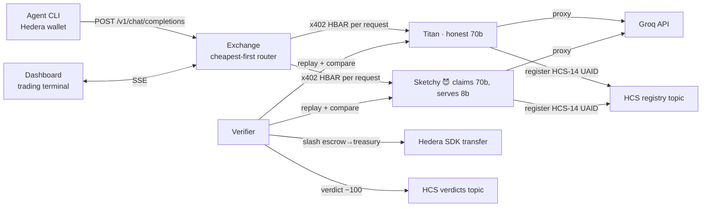

# AgentRouter — DevRel Briefing

*Built at ETHGlobal Lisbon, July 2026 · Hackathon MVP, working end-to-end*

## The one-liner

**AgentRouter is an on-chain OpenRouter: a marketplace where AI agents buy LLM inference per-request with native HBAR on Hedera, and where providers who lie about what model they're serving get caught and financially slashed.**

## The story (use this narrative)

Today, when you call an LLM API, you *trust* the provider is running the model you paid for. There is no verification. As AI agents become autonomous economic actors — picking providers, paying per request, no human in the loop — this trust gap becomes an attack surface: a provider can advertise a 70B model, serve a cheap 8B model, pocket the margin, and undercut honest competitors on price. **The cheapest fraud wins the routing war.**

AgentRouter closes the loop with three primitives:

1. **x402 (Coinbase's open payment standard)** — HTTP-native payments. Every inference request is individually paid in **native HBAR** on Hedera Testnet via the HTTP 402 status code. No accounts, no API keys, no subscriptions — an agent with a Hedera wallet can buy one single completion.
2. **HCS-14 (Universal Agent IDs)** — providers are on-chain Hedera identities (`uaid:aid:hedera:testnet:0.0.x`) with portable reputation, registered and audited on the **Hedera Consensus Service**, not our own fork.
3. **Optimistic verification + staking** — providers stake collateral. A verifier randomly replays past prompts (temperature 0) against a second provider claiming the same model. If answers diverge, the cheater's stake is slashed, negative reputation is filed on-chain, and they're ejected from routing.

The demo makes this visceral: the cheating provider *wins all the traffic* on price — until the verifier catches it, a red SLASHED banner fires, and **the market price index visibly steps up** as fraud exits the market. Economics, on screen, in real time.

## What happens in the demo (~90 seconds, one command)

`pnpm demo` boots everything and narrates. What she'll see, in order:

| # | Beat | On screen |
|---|------|-----------|
| 1 | 3 providers boot: **Titan Compute** (llama-3.3-70b @ 0.10 ℏ), **Budget Inference Co** (llama-3.1-8b @ 0.04 ℏ), **SketchyGPU Labs** (*claims* 70b @ 0.08 ℏ, **secretly serves 8b**). Each self-registers its HCS-14 Universal Agent ID on the HCS registry topic | Provider table fills, all ● live, 50 ℏ stake each |
| 2 | Exchange discovers them from the HCS registry, routes by cheapest-per-model | — |
| 3 | Agent buys 5 completions. Every one routes to SketchyGPU (cheapest 70b claimant). Balance drains 10.00 → 9.60 ℏ with per-call payment refs (Hashscan) | Request feed streams, price index draws at 0.08 ℏ/req |
| 4 | Verifier samples a past request, replays it at temp 0 against SketchyGPU **and** witness Titan. Similarity: **0–7%** (threshold: 35%) | Verifier panel: "7% ✗ DIVERGENT" |
| 5 | Slash: stake 50 → 25 ℏ (escrow→treasury), reputation → 0, verdict published to HCS, removed from routing | 🔴 Full-width flashing SLASHED banner, row struck through |
| 6 | Next 70b request routes to honest Titan at 0.10 ℏ | **Price index steps up 0.08 → 0.10 ℏ/req** — the market repricing after fraud exits. This is the closing line. |

The cheat is even visible in the answers: SketchyGPU's canned/8B response to "What is x402?" is *"x402 is an HTTP error code for payments"* (wrong), vs Titan's correct protocol description.

## Architecture (30-second version)



- **TypeScript pnpm monorepo**: `packages/` — `provider` `exchange` `verifier` `agent` `dashboard` (Next.js) `shared`
- Providers expose the **OpenAI-compatible** `POST /v1/chat/completions` — any existing OpenAI SDK client can point at the exchange unchanged
- Everything in-memory, no DB, no auth — deliberate MVP scope

## What's real vs. what's mocked (be precise here — judges ask)

| Component | Status |
|---|---|
| x402 payment protocol | **Real** — official `@x402/*` v2.19 packages, real 402 challenges settled on `hedera:testnet` in **native HBAR** via the hosted facilitator ladder (`api.testnet.blocky402.com` → `x402.org/facilitator`, both feePayer-sponsored). Verified settlements + balance deltas in PROOF.md |
| Agent identity (HCS-14) | **Real** — providers register a Universal Agent ID (`uaid:aid:hedera:testnet:0.0.x`) to the HCS registry topic (`0.0.9744593`); trades and verdicts land on their own topics — an on-chain, Mirror-Node-readable audit trail |
| Staking / slashing | **Real, SDK-native (no Solidity)** — 50 ℏ staked to an escrow account via a Hedera SDK `TransferTransaction`; a fraud verdict slashes escrow→treasury with a second SDK transfer + an HCS verdict message |
| Inference | **Real** — Groq API (`llama-3.3-70b-versatile` / `llama-3.1-8b-instant`). Falls back to deterministic canned responses without an API key — and the canned "cheat variant" still diverges, so the whole demo works air-gapped |
| MOCK_MODE | First-class stage fallback: in-memory ledger/registry/stakes, zero RPC. **Same UI, same flow, same command.** If testnet dies during judging, nothing changes on screen |
| GPU supply | **Not real** — providers proxy Groq. The marketplace/verification mechanics are the contribution, not GPU ops |

## Questions she'll get, with answers

**"Is the money real?"**
Real testnet HBAR settling on Hedera Testnet via the hosted x402 facilitator (feePayer-sponsored, so payers need zero gas). Mainnet would be a config change (network string + facilitator), not an architecture change.

**"How do you catch the cheater without running the model yourself?"**
Optimistic replay: at temperature 0, the same model gives near-identical answers. The verifier replays a sampled prompt against the accused *and* a second provider claiming the same model, then compares (Jaccard similarity over word-bigrams, threshold 0.35). Different model → different phrasing → similarity collapses (we measured 0–7% for 8B-vs-70B).

**"Can a cheater beat the verifier?"**
Partially, and we say so. A cheater could serve the real model only for short/simple prompts, or detect audit-looking traffic. Production hardening = TEE attestation or zkML proofs (explicitly out of MVP scope), more verifiers, stealthier sampling. The point is the *economic loop*: detection → slash → reputation → routing exit.

**"Who watches the verifier?"**
In the MVP the verifier is trusted (single slash right over the escrow). The honest answer: production needs verifier sets with their own stakes/disputes — a natural extension of the HCS verdict trail, where multiple verifiers post competing attestations.

**"Why x402 instead of payment channels / subscriptions?"**
Per-request granularity with zero relationship setup. An agent that has never seen a provider before can buy exactly one request. It's just HTTP: a 402 response carries payment requirements, the client signs, retries, done. No channel opening, no deposits, no accounts.

**"Why HCS-14?"**
Portable, standard identity + reputation, native to Hedera. Each agent gets a Universal Agent ID (`uaid:aid:hedera:testnet:0.0.x`) and a tamper-evident record on the HCS registry/verdicts topics. A provider slashed on AgentRouter carries that record to any other marketplace reading the same topics — and HCS-14 is spec-bridged to ERC-8004 / A2A / x402 if EVM interop is ever needed. The point of a standard is sharing it.

**"Why should the price go UP after the slash? Isn't that bad?"**
That's the demo's best moment, lean into it: the cheater's 0.08 ℏ price was *fraudulent* — you were paying for 70b and getting 8b. The index stepping up to the honest 0.10 ℏ is the market pricing truthfully again. Verification makes prices *honest*, not low.

**"What's the business model?"**
(MVP has none — be honest.) Natural candidates: exchange spread/fee per routed request, listing stakes, verifier rewards funded from slashes.

**"OpenAI-compatible — so what?"**
Point any existing OpenAI SDK at the exchange URL and it works. Adoption path for the entire existing agent ecosystem is `base_url` swap.

## Try it herself (10 minutes, no funding, no API keys)

```bash
git clone <repo> && cd Inferit
pnpm install
cp .env.example .env   # MOCK_MODE=true — no chain, no keys needed
pnpm demo          # the whole story, narrated, in one terminal
pnpm dashboard     # second terminal → http://localhost:3000
```

Optional real inference: put a free Groq key ([console.groq.com/keys](https://console.groq.com/keys)) in `.env`.
Real payments: set a Hedera testnet operator in `.env`, run `pnpm setup-hedera` (creates + funds all accounts), set `MOCK_MODE=false`.

## Document index (what to share)

| File | What it is |
|---|---|
| [README.md](../README.md) | Quickstart, architecture diagram, run order, reset instructions, "Not in this MVP" |
| **DEVREL_BRIEF.md** (this file) | The narrative, demo beats, Q&A, real-vs-mocked |
| [RESEARCH.md](RESEARCH.md) | Verified integration research: exact x402 package APIs, HCS-14 identity, Groq model IDs — with sources and dates |
| [.env.example](../.env.example) | Every env var + Hedera setup |
| [deployments.json](../deployments.json) | Hedera network + HCS topics in use |
| [PROOF.md](PROOF.md) | Live Hashscan links for real x402 settlements, demo accounts, and HCS topics |
| [verifier/src/index.ts](../packages/verifier/src/index.ts) | The audit loop — the most interesting code to walk through |

## Glossary (for non-crypto audiences)

- **x402** — Coinbase's open protocol reviving HTTP status code 402 "Payment Required": server says what it costs, client pays (here in native HBAR), request proceeds. Machine-to-machine payments over plain HTTP.
- **HCS-14** — Hedera standard ("Universal Agent IDs") giving AI agents a portable on-chain identity (`uaid:aid:hedera:testnet:0.0.x`) resolvable across web2 and web3.
- **HCS (Hedera Consensus Service)** — Hedera's ordered, timestamped message log; we use topics for the agent registry, trade records, and verifier verdicts — the tamper-evident audit trail.
- **Slashing** — destroying part of a staked deposit as punishment for provable misbehavior. Skin in the game.
- **Facilitator** — hosted x402 service that verifies + settles payments on-chain (and sponsors the fee) so neither buyer nor seller runs blockchain infrastructure.
- **Hedera Testnet** — Hedera's play-money environment with real mechanics; explorer is Hashscan.
- **Temperature 0** — LLM setting for (near-)deterministic output; same prompt → same answer, which is what makes replay-verification possible.
