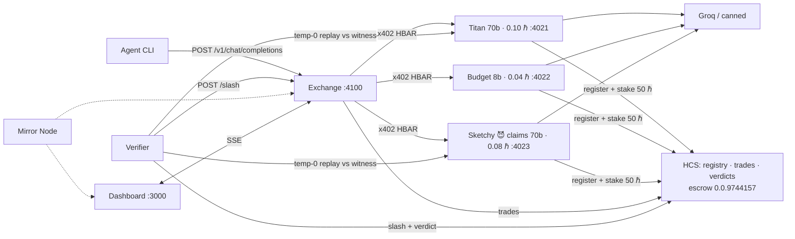

# GUIDE.md — consolidated reference

**What this is:** AgentRouter is an on-chain OpenRouter — an exchange where AI agents buy LLM inference per-request with HBAR via x402, from providers whose identity, trades, and verification verdicts live on Hedera Consensus Service. Providers stake HBAR into escrow; a verifier replays sampled prompts against witnesses and slashes providers caught serving cheaper models than advertised. Everything runs on Hedera Testnet with mock mode as an offline-proof fallback.

## Architecture



## Endpoints

| Service | Endpoint | What |
|---|---|---|
| Provider :402x | `GET /info` | name, model, priceHbar, wallet, agentId |
| | `GET /healthz` | liveness |
| | `POST /v1/chat/completions` | **paid** (x402/mock), OpenAI-compatible |
| Exchange :4100 | `POST /v1/chat/completions` | buy inference, routed to cheapest claimant; response + `agentrouter{}` metadata |
| | `GET /providers` | routing table (model, priceHbar, stakeHbar, reputation, live, slashed) |
| | `GET /log` | recent request log |
| | `GET /events` | SSE: snapshot / request / providers / slashed / verify |
| | `POST /slash` | verifier-only: mark slashed, cut stake, eject |
| | `POST /verify-report` | verifier audit results → SSE |
| Dashboard :3000 | `/` | the terminal UI |

## Env vars (.env, never committed)

| Var | Default | Used by |
|---|---|---|
| `MOCK_MODE` | `true` | all — in-memory chain/payments when true |
| `GROQ_API_KEY` | — | providers (canned fallback without) |
| `CHEAT_MODE` | `true` | provider3 serves 8b while advertising 70b |
| `FACILITATOR_URL` | ladder | override rung 1; ladder = blocky402 → x402.org |
| `HEDERA_OPERATOR_ID/KEY/EVM_ADDRESS` | — | setup script, topic creation, treasury |
| `HEDERA_<ROLE>_ID/KEY/EVM` | from `pnpm setup-hedera` | AGENT, EXCHANGE, PROVIDER1-3, VERIFIER, ESCROW |
| `STAKE_HBAR` | `50` | provider boot-time stake to escrow |
| `EXCHANGE_FEE_BPS` | `1000` | taker fee in basis points (10%) |
| `REFUND_ON_FAILURE` | `true` | refund settled payments when the provider call fails |
| `SLASH_HBAR` | `25` | verifier slash amount |
| `SIMILARITY_THRESHOLD` | `0.35` | fraud line |
| `VERIFY_INTERVAL_MS` | `15000` | audit cadence |
| `PROVIDER_URLS` | 3 localhosts | exchange discovery list |
| `PROVIDER_NAME` / `PROVIDER_MODEL` / `PROVIDER_PRICE_HBAR` / `PROVIDER_PORT` | Custom Provider / 70b / `0.10` / `4025` | custom provider (`pnpm provider`) — list your own compute, no code edits |
| `PROVIDER_PUBLIC_URL` | localhost:\<port\> | public address a provider registers on HCS (tunnel/VPS) |
| `EXCHANGE_URL` | `http://localhost:4100` | agent, verifier, dashboard |
| `AGENT_MODEL` / `AGENT_MOCK_BALANCE_HBAR` | 70b / `10` | agent |
| `HCS_REGISTRY_TOPIC` / `HCS_TRADES_TOPIC` / `HCS_VERDICTS_TOPIC` | deployments.json | HCS audit trail (live) |

## Pricing: 10% taker-side fee

The exchange charges a percentage fee on top of each provider's ask — **the provider
always receives exactly its listed price**; the agent pays `price + fee`.

- `EXCHANGE_FEE_BPS` (default `1000` = 10%). Fee math is integer tinybars only:
  `fee = ceil(price × bps / 10000)` — rounded UP so the exchange never underquotes.
- The 402 quote is **dynamic per request** (depends on which provider routing picks) and
  **pinned for 60s**: the paid retry settles at the quoted total even if provider prices
  change in between. Expired/unknown quote → fresh 402.
- On provider failure the agent is made whole: in real mode the verified payment is
  canceled before settlement (never charged); if money already moved, `REFUND_ON_FAILURE`
  (default true) sends it back with memo `refund:<quoteId>`.
- `GET /stats` → `{ totalVolumeHbar, requests, feeRevenueHbar, refunds, refundFailures, feeBps }`;
  the dashboard's EXCHANGE REVENUE chip mirrors it live.
- HCS trade messages carry `priceHbar`, `feeHbar`, `totalHbar` and BOTH settlement txs
  (`inboundTx` agent→exchange, `paymentTx` exchange→provider).

## Demo script

```bash
pnpm install
pnpm demo          # narrated: boot → 5 paid calls → cheapest wins → verifier catches p3 → SLASH → reroute
pnpm dashboard     # second terminal → localhost:3000
```

Real chain: credentials in `.env` → `pnpm setup-hedera` → `MOCK_MODE=false` → same commands. Gate proof: `MOCK_MODE=false pnpm smoke`.

> **Demo note:** `pnpm demo` intentionally boots only providers 1–3. A fourth profile,
> `provider4` (NimbusAI), is an *honest* 70b provider priced at 0.06 ℏ — cheaper than the
> cheater's 0.08 ℏ. If you boot it, cheapest-first routing sends 70b traffic to NimbusAI, the
> cheater never wins traffic, and the slash sting won't fire. Boot `provider4` only to
> demonstrate honest permissionless supply joining, not during the fraud demo.

## Components

| Component | Owns |
|---|---|
| Supply | Providers (Groq-backed inference) |
| Agent + verifier | Buyer agent, audit loop, test matrix |
| DevRel | Payments story, HCS map, submission |
| Exchange | Routing core + dashboard |

## Troubleshooting

| Symptom | Cause / fix |
|---|---|
| Exchange sees no providers / stale table | **Mirror lag is 1-5s** — registration takes a beat to appear; also check provider `/healthz` and `PROVIDER_URLS` |
| Tunnel URLs dead | trycloudflare quick tunnels die with the laptop/process — restart per [TESTING.md](TESTING.md); durable hosting (Railway/Vercel) avoids this |
| Groq 429s under `--spam` | free-tier rate limit — slow down, or unset `GROQ_API_KEY` to switch to canned answers (flow unaffected) |
| Boot log: facilitator rung unreachable | ladder auto-advances; if all rungs fail → `MOCK_MODE=true` and the demo continues offline |
| `Missing HEDERA_*` | run `pnpm setup-hedera` where the operator key lives, or paste the role lines into `.env` |
| Balance queries slow/hang | consensus-node query needs outbound gRPC; check network, or trust the Hashscan links |
| False slash risk on stage | lower `SIMILARITY_THRESHOLD` to 0.25 (honest-pair scores cluster ≥0.6, cheat pairs ≤0.07) |

## Proof

All on-chain evidence: [PROOF.md](PROOF.md) — two settled x402 transactions with exact-amount deltas, all account links, live HCS topics, staking + slash txs.
